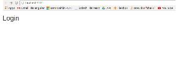
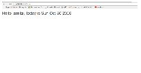

# React


What is React?
React is a JS library for rendering web pages. That’s it. The closest equivalent is Angular with only directives. Without the other features such as services, controllers etc.


So why use it?
- React is fast. It renders the pages using virtual DOM, instead of rendering to the actual DOM, it uses the virtual DOM compare the changes of the page and then renders to the DOM only the changes.
- It enforces the developer to use software development best practices, such as unidirectional data flow.
- React native - react development and react native are very similar, and react native is excellent way to create mobile native apps.
- It allows server rendering.
- Once you understand the principles, it is very easy to write complex web applications.
- React has huge ecosystem with libraries like Redux, GraphQL, Relay and more that are complementary technologies to make a great development process.

## The React way - 4 principles of developing react applications
1. Break the UI to components, and each component to little components and so on:


2. Keep unidirectional data flow - from the top component to the children by using props.
3. Identify the UI state.
4. Dispatch actions to change the state.

## Build a React application
The best way to learn react is to do it with an example, I will build a simple application that greet the user. I will do it step by step, each step will demonstrate one or more methods and principle. Although it seems like very small, it is enough to understand react concepts and how to expand it to a real application.

### Building the app 
I will use the new “create-react-app” that removes all the boilerplate of configuring all the packaging and serving of the react app (that is a pain).

### Install create-react-app, create the app:
``` 
npm install -g create-react-app
create-react-app HelloApp
cd HelloApp
npm start
```


Now we can start implementing our shiny HelloApp.
The final app will have two screens, one for login, and the other to greet the user that logged in. 

### Write the first component

In the folder tree, we will create a _components_ folder to contain all the component files, we will use sub folders for each page.
The component name and filename will begin with capital letter (this is the convention).
Top components (that displays the whole page) will end with ‘Page’.

```JavaScript
// src/components/hello/HelloPage.js
import React, {Component} from 'react';

class HelloPage extends Component {
  render() {
    return (
      <div>
        <h1>Hello</h1>
      </div>
    );
  }
}

export default HelloPage;
```
HelloPage is a class that derived from React.component, it must have a render method, that return the graphic markup of the component in JSX, which is a language that is very similar to HTML.

### JSX
JSX is a syntactic sugar for function calls and object construction. Basically, it let us write the code easelly and makes the code more understandable.
Instead of this:
```JavaScript
React.createElement(
a,
{href:"spectory.com"},
'Spectory website’'
)
```
We can write:
```JavaScript
<a href=”spectory.com”>Spectory website</a>
```
It is very similar to HTML, and it let us integrate JS code inside, we can change our component to be more dynamic by adding a parameter to it by surrounding it with curly braces:
```JavaScript
import React, {Component} from 'react';

class HelloPage extends Component {
  render() {
    let userName = 'amitai';
    return (
      <div>
        <h1>Hello, {userName}, today is {(new Date()).toDateString()}</h1>
      </div>
    );
  }
}

export default HelloPage;
```

In order to view our new component we need to make some changes in App.js:

```JavaScript
import React, { Component } from 'react';
import './App.css';
import HelloPage from './components/hello/HelloPage';

class App extends Component {
  render() {
    return (
      <div >
        <HelloPage />
      </div>
    );
  }
}

export default App;
```
I replaces the previous content with the new HelloPage component.


The way React renders all the component is through the react-dom library, with the method:
```JavaScript
ReactDOM.render(
  <App />,
  document.getElementById('root')
);
```
Once, react-dom was part of react, but because today we can use react in environments without DOM, such as React native, or even Node (some do it), The react team separated it from react library.


So our HelloPage is ready,  before we will build the login page we will need a router to navigate between these two pages. I will use the react-router.
Lets install it:
```
npm install --save react-router
```
Then we will import it and use it in our App component:
```JavaScript
// src/app.js
import React, { Component } from 'react';
import {Router, Route, browserHistory} from 'react-router';
import './App.css';
import HelloPage from './components/hello/HelloPage';
import LoginPage from './components/login/LoginPage';

class App extends Component {
  render() {
    return (
      <div>
        <Router history={browserHistory}>
          <Route path='/' component={LoginPage} />
          <Route path='/hello' component={HelloPage} />
        </Router>
      </div>
    );
  }
}

export default App;
```
The Router uses browserHistory to navigate between pages, its children are the routes, every route has a path and a component.

I will create a skeleton for our login page:
```JavaScript
// src/components/login/LoginPage
import React, {Component} from 'react';

class LoginPage extends Component {
  render() {
    return (
      <div>
        <h1>Login</h1>
      </div>
    );
  }
}

export default LoginPage;
```
And now if I go to ‘/’ I get:



And wen I go to ‘/hello’:



### The login page
Now it is time to build a little more complex component for our login page. As I said before, the way to built it is to view the mockup and split into little components:


Login page:
- Header
- Form
  - inside the form there are two types of components, InputField - for username and password, 
  - Button

We will build the component from top to bottom, start with the login page:
```JavaScript
// src/components/login/LoginPage
import React, {Component} from 'react';

import LoginHeader from './LoginHeader';
import LoginForm from './LoginForm';

class LoginPage extends Component {
  render() {
    return (
      <div>
        <LoginHeader />
        <LoginForm />
      </div>
    );
  }
}

export default LoginPage;
```
Then we will create the login header:
```JavaScript
// src/components/login/LoginHeader
import React from 'react';

const LoginHeader = () => {
  return (
    <div>
      <h1>Login</h1>
    </div>
  );
};

export default LoginHeader;
```
What is going on? This doesn’t look like a react component at all!

### Dumb and smart components
That’s right but it is a react component. There are two types of react components: dumb and smart (or Presentational and Container Components as Dan Abramov the creator of Redux calls them).
The smart component is state awareness (stateful),  it will be connected to redux, and has component lifecycle methods (we will reach that later). The dumb components, are only used to display the UI elements, they get their props from their parent and they are not aware to the state (stateless). 
As a rule, the default type of the component will be “dumb” unless there is a need to upgrade it. As you can see,  a dumb component is a simple function.

Now we will build the LoginForm. Because this component should activate actions (login), it will be a smart component:
```JavaScript
// src/components/login/LoginForm
import React, {Component} from 'react';


import InputField from '../common/InputField';
import SubmitButton from '../common/SubmitButton';

class LoginForm extends Component {
  render() {
    return (
      <form>
        <InputField name="username" />
        <InputField name="password" />
        <SubmitButton value="login" />
      </form>
    );
  }
}

export default LoginForm;
```
As you can see, both Button and InputField are not in the login folder, but in the common components folder. We will put all the shared components in a this folder.
I will create them as dumb components:
```JavaScript
// src/components/common/InputField.js
import React from 'react';

const InputField = (props) => {
  return (
    <div className="form-group">
      <label className="control-label">{props.name}</label>
      <input className="form-control" type="text" onChange={props.onChange} />
    </div>
  );
};

export default InputField;
```
```JavaScript
// src/components/common/SubmitButton.js
import React from 'react';

const SubmitButton = (props) => {
  return (
    <div>
      <input className="btn btn-primary btn-lg" type="submit" value={props.value} />
    </div>
  );
};

export default SubmitButton;
```
I added a little bootstrap and now we have a beautiful login page.


