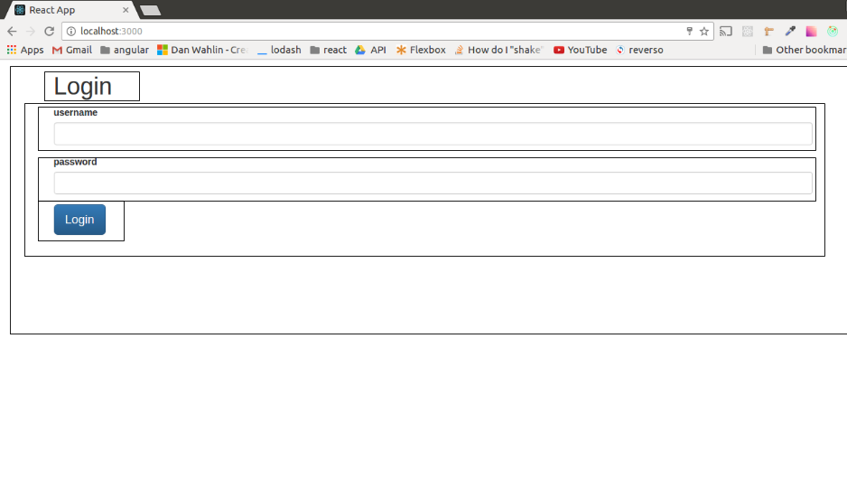

# React


What is React?
React is a JS library for rendering web pages. That’s it. The closest equivalent is Angular with only directives without the other features such as services, controllers etc.


So why use it?
- React is fast. It renders the pages using virtual DOM, instead of rendering to the actual DOM, it uses the virtual DOM compare the changes of the page and then renders to the DOM only the changes.
- It enforces the developer to use software development best practices, such as unidirectional data flow.
- React native - react development and react native are very similar, and react native is excellent way to create mobile native apps.
- It allows server rendering.
- Once you understand the principles, it is very easy to write complex web applications.
- React has huge ecosystem with libraries like Redux, GraphQL, Relay and more that are complementary technologies to make a great development process.

## The React way - 4 principles of developing react applications
1. Break the UI to components, and each component to little components and so on:



2. Keep unidirectional data flow - from the top component to the children by using props.
3. Identify the UI state.
4. Dispatch actions to change the state.

## Build a React application
The best way to learn react is to do it with an example, I will build a simple application that greet the user. I will do it step by step, each step will demonstrate one or more methods and principle. Although it seems like very small, it is enough to understand react concepts and how to expand it to a real application.

### Building the app 
I will use the new “create-react-app” that removes all the boilerplate of configuring all the packaging and serving of the react app (that is a pain).

### Install create-react-app, create the app:
``` 
npm install -g create-react-app
create-react-app HelloApp
cd HelloApp
npm start
```


Now we can start implementing our shiny HelloApp.
The final app will have two screens, one for login, and the other to greet the user that logged in. 

### Write the first component

In the folder tree, we will create a _components_ folder to contain all the component files, we will use sub folders for each page.
The component name and filename will begin with capital letter (this is the convention).
Top components (that displays the whole page) will end with ‘Page’.

```JavaScript
// src/components/hello/HelloPage.js
import React, {Component} from 'react';

class HelloPage extends Component {
  render() {
    return (
      <div>
        <h1>Hello</h1>
      </div>
    );
  }
}

export default HelloPage;
```
HelloPage is a class that derived from React.component, it must have a render method, that return the graphic markup of the component in JSX, which is a language that is very similar to HTML.

### JSX
JSX is a syntactic sugar for function calls and object construction. Basically, it let us write the code easelly and makes the code more understandable.
Instead of this:
```JavaScript
React.createElement(
a,
{href:"spectory.com"},
'Spectory website’'
)
```
We can write:
```JavaScript
<a href=”spectory.com”>Spectory website</a>
```
It is very similar to HTML, and it let us integrate JS code inside, we can change our component to be more dynamic by adding a parameter to it by surrounding it with curly braces:
```JavaScript
import React, {Component} from 'react';

class HelloPage extends Component {
  render() {
    let userName = 'amitai';
    return (
      <div>
        <h1>Hello, {userName}, today is {(new Date()).toDateString()}</h1>
      </div>
    );
  }
}

export default HelloPage;
```

In order to view our new component we need to make some changes in App.js:

```JavaScript
import React, { Component } from 'react';
import './App.css';
import HelloPage from './components/hello/HelloPage';

class App extends Component {
  render() {
    return (
      <div >
        <HelloPage />
      </div>
    );
  }
}

export default App;
```
I replaces the previous content with the new HelloPage component.


The way React renders all the component is through the react-dom library, with the method:
```JavaScript
ReactDOM.render(
  <App />,
  document.getElementById('root')
);
```
Once, react-dom was part of react, but because today we can use react in environments without DOM, such as React native, or even Node (some do it), The react team separated it from react library.


So our HelloPage is ready,  before we will build the login page we will need a router to navigate between these two pages. I will use the react-router.
Lets install it:
```
npm install --save react-router
```
Then we will import it and use it in our App component:
```JavaScript
// src/app.js
import React, { Component } from 'react';
import {Router, Route, browserHistory} from 'react-router';
import './App.css';
import HelloPage from './components/hello/HelloPage';
import LoginPage from './components/login/LoginPage';

class App extends Component {
  render() {
    return (
      <div>
        <Router history={browserHistory}>
          <Route path='/' component={LoginPage} />
          <Route path='/hello' component={HelloPage} />
        </Router>
      </div>
    );
  }
}

export default App;
```
The Router uses browserHistory to navigate between pages, its children are the routes, every route has a path and a component.

I will create a skeleton for our login page:
```JavaScript
// src/components/login/LoginPage
import React, {Component} from 'react';

class LoginPage extends Component {
  render() {
    return (
      <div>
        <h1>Login</h1>
      </div>
    );
  }
}

export default LoginPage;
```
And now if I go to ‘/’ I get:


And wen I go to ‘/hello’:


### The login page
Now it is time to build a little more complex component for our login page. As I said before, the way to built it is to view the mockup and split into little components:


Login page:
- Header
- Form
  - inside the form there are two types of components, InputField - for username and password, 
  - Button

We will build the component from top to bottom, start with the login page:
```JavaScript
// src/components/login/LoginPage
import React, {Component} from 'react';

import LoginHeader from './LoginHeader';
import LoginForm from './LoginForm';

class LoginPage extends Component {
  render() {
    return (
      <div>
        <LoginHeader />
        <LoginForm />
      </div>
    );
  }
}

export default LoginPage;
```
Then we will create the login header:
```JavaScript
// src/components/login/LoginHeader
import React from 'react';

const LoginHeader = () => {
  return (
    <div>
      <h1>Login</h1>
    </div>
  );
};

export default LoginHeader;
```
What is going on? This doesn’t look like a react component at all!

### Dumb and smart components
That’s right but it is a react component. There are two types of react components: dumb and smart (or Presentational and Container Components as Dan Abramov the creator of Redux calls them).
The smart component is state awareness (stateful),  it will be connected to redux, and has component lifecycle methods (we will reach that later). The dumb components, are only used to display the UI elements, they get their props from their parent and they are not aware to the state (stateless). 
As a rule, the default type of the component will be “dumb” unless there is a need to upgrade it. As you can see,  a dumb component is a simple function.

Now we will build the LoginForm. Because this component should activate actions (login), it will be a smart component:
```JavaScript
// src/components/login/LoginForm
import React, {Component} from 'react';


import InputField from '../common/InputField';
import SubmitButton from '../common/SubmitButton';

class LoginForm extends Component {
  render() {
    return (
      <form>
        <InputField name="username" />
        <InputField name="password" />
        <SubmitButton value="login" />
      </form>
    );
  }
}

export default LoginForm;
```
As you can see, both Button and InputField are not in the login folder, but in the common components folder. We will put all the shared components in a this folder.
I will create them as dumb components:
```JavaScript
// src/components/common/InputField.js
import React from 'react';

const InputField = (props) => {
  return (
    <div className="form-group">
      <label className="control-label">{props.name}</label>
      <input className="form-control" type="text" onChange={props.onChange} />
    </div>
  );
};

export default InputField;
```
```JavaScript
// src/components/common/SubmitButton.js
import React from 'react';

const SubmitButton = (props) => {
  return (
    <div>
      <input className="btn btn-primary btn-lg" type="submit" value={props.value} />
    </div>
  );
};

export default SubmitButton;
```
I added a little bootstrap and now we have a beautiful login page.


## Adding functionality
The application we have build looks fine but it doesn’t do anything. As I wrote in the beginning, React is only a rendering library, so we need something else to add the functionality. It can be vanilla JS, frameworks like Relay, meteor or even Angular, but the common usage is with Flux, especially with Redux. 

Redux is a set of library (actualy set of libraries) that simplified Flux. It is the most popular library to use with React.

## Redux
I will not describe the Flux architecture , only the way Redux implements it.
Redux is a library that helps maintaining the application state. It uses 3 type of objects:

1. Actions - action is a function that the application is using to send data to the store. Every action has a type, that being used by the reducer to change the state.
2. Reducers - The reducers takes the data from the action and insert it into the state.
3. Store - the store has few responsibilities:
    - Hold the state of the application, and expose it.
    - Dispatch actions.
    - Subscription on the state changes to listeners.

### Redux data flow
Let’s view the login process to explain the Redux data flow:

1. The user presses on the ‘Login’ button.
2. This dispatches a login action.
3. The login action sets the result of the login (the user data)
4. The reducer collects the data and stores it in the state.
5. The store notifies the listeners (the components).
6. The properties of the components change and the display updates.

### Redux with react
Redux offers the ‘react-redux’ library that provides functionality to integrate react components with redux store and actions. We will see how to use them in our application

### Async actions
Many of our operations in our app are asynchronous. For instance: ajax calls, working with local storage, GPS and more. Redux offers the ‘redux-thunk’ library to implement async actions. It uses an action to dispatch another action(s) when it returns from the async call.

## Adding redux to our application:
Let’s see how to add Redux and make our app dynamic:
The action we will implement is the login action.
It is an async action because it needs to make an ajax call. 

### Using mock API
A good practice for development UI is using mock services. This way we can skip errors in the server, and focus on the UI.
I will a a mock login that we will use in this app:
```JavaScript
// src/api/mockApi.js
import _ from 'lodash';

const users = [
  {
    id: 1,
    username: 'amitai@spectory.com',
    password: 'qwe123',
  }
];

export function authenticate(username, password) {
   return new Promise((resolve, reject) => {
      setTimeout(() => {
        let user = _.find(users, user => {
          return user.username === username;
        });
        if(user && user.password === password) {
          resolve(Object.assign({}, user));
        }
        else reject(`Wrong login credentials`);
      }, 500);
    });
}
```
This mock has one function (authenticate) that returns a promise. It check against a static list if the given credentials are valid or not and resolve or reject accordingly. Notice that I added a short delay to simulate roundtrip to the server.

Before doing it we need to install redux libraries:
```
npm install --save redux react-redux redux-thunk
```
Let's write our login action:
```JavaScript
// src/action/loginActions.js
import * as actionTypes from './actionTypes'; 
import { browserHistory } from 'react-router';
import { authenticate } from '../api/mockApi';

export function login_success(user) {
  return {
    type: LOGIN_SUCCESS,
    user
  }
}

export function login_error(err) {
  return {
    type: LOGIN_ERROR,
    err
  }
}

export function login({username, password}) {
  return (dispatch) => {
    return authenticate(username, password)
    .then((user) => {
      dispatch(login_success(user));
      browserHistory.push('/hello');
    })
    .catch((err) => {
      dispatch(login_error(err));
    })
  }
}
```
We have here three actions: login, login_succsess, and login_error.
The login action make the call to the api, when the result returns, it dispatch either login_success or login_error. In case of success, we will navigate to the ‘/hello’ route that we defined earlier.
It is a good practice to write all the actions’ types in a separate file, and not use them as strings.

```JavaScript
// src/actions/actionTypes.js
export const LOGIN_SUCCESS = 'LOGIN_SUCCESS';
export const LOGIN_ERROR = 'LOGIN_ERROR';
```
### implement the reducer
```JavaScript
// src/reducers/login_reducer.js
import * as types from '../actions/actionTypes';
import initialState from './initialState';

export default function loginReducer(state = initialState.login, action) {
  switch (action.type) {
    case types.LOGIN_ERROR:
      return Object.assign({}, state, { username: '' });
    case types.LOGIN_SUCCESS:
      return Object.assign({}, state, { username: action.user.username });
    default:
      return state;
  }
}
```
We can see here some redux rules:
- The reducer is a pure function that receives action and a state and returns new state.
- Any action has a branch in the switch case that manipulate the state.
- The state is immutable - it means that instead of update the state, we create a new one. The best way is to use ES6 object.assign. Redux compares the address of the states in order to update the store, unless we will create new object, the store and the components will not be updated. It lets redux perform much faster than deep comparing objects.
- All actions are calling all reducers, it means that we have to define a default that will return the state.
- We can use default parameter in order to init our state. It is better to do it in a different file where we can see the whole initial state and also its structure. The application state structure is very important. It should be designed in thought to serve the application functionality:
    - Before you add object to the state, stop, and think. 
    - Keep it small and simple as possible.
    - remember that you can manipulate this state before transferring it to the props (will see that in a minute). 
    - Do not keep duplications or redundant data. 
    - Treat it like you treat the database tables, it will gain you a lot of headaches in the future.

### The application state
We have only two things in the application state: 
- The user
- Login errors

This is the initial state:
```JavaScript
export default initialState = {
  login: {
    user: null,
    error: '',
  }
}
```
If we are working with one reducer we can add it to the store directly, but it is much better to divide it to multiple reducers that every one of them is responsible for a slice of the state.
We can use redux ‘combineReducers’ to do that:
```JavaScript
// src/reducers/index.js
import { combineReducers } from 'redux';
import login from './login_reducer';

export default rootRecucer = combineReducers({
  login
});
```
Notice that the name of the slice will be login (as the name we put in the combineReducer function.

### The redux store
Now we need to create a store and connect it to the reducers on the one hand and to the components on the other hand.
```JavaScript
// src/app.js
import React, { Component } from 'react';
import {Router, Route, browserHistory} from 'react-router';
import { createStore, applyMiddleware } from 'redux';
import { Provider } from 'react-redux';
import thunk from 'redux-thunk';

import rootReducer from './reducers';
import './App.css';
import HelloPage from './components/hello/HelloPage';
import LoginPage from './components/login/LoginPage';

const store = createStore(
  rootReducer,
  applyMiddleware(
    thunk
  )
)

class App extends Component {
  render() {
    return (
      <Provider store={store}>
        <div className="container">
          <Router history={browserHistory}>
            <Route path='/' component={LoginPage} />
            <Route path='/hello' component={HelloPage} />
          </Router>
        </div>
      </Provider>
    );
  }
}

export default App;
```
A lot is going on here:

- We create a store, and give it rootReducer that we created earlier, the second argument is the middleware you want to integrate to the store, in our case it is only redux-thunk, but we can add more if we would like. This is the connection to the reducers.
- Next we will connect the store to the components by wrapping the whole application with Provider from react-redux. This will inject the store to all the children of the components. 

This is good time to explain react components’ children. Children is a unique prop in react, it is the only one that you do not need to specify, it is created automatically when the component has child elements. It lets the parent component change the state or the context of its children (similar to ng-transclude). This way the Provider component or the Router works.


### Get the state and action to the components
The last thing that we need to add is the part where the components receive the state and actions
We will use react-redux for that:
```JavaScript
// src/components/LoginForm.js
import React, {Component} from 'react';
import { connect } from 'react-redux';
import { bindActionCreators } from 'redux';
import * as loginActions from '../../actions/loginActions';


import InputField from '../common/InputField';
import SubmitButton from '../common/SubmitButton';


class LoginForm extends Component {
  constructor(props) {
    super(props);
    this.state = {
      username: '',
      password: ''
    }
  }

  onChangeUser = (e) => {
    this.setState({ ...this.state, email: e.target.value });
  }

  onChangePassword = (e) => {
    this.setState({ ...this.state, password: e.target.value });
  }
  
  onSubmit = (e) => {
    e.preventDefault();
    this.props.actions.login(this.state);
  }
  render() {
    return (
      <form onSubmit={this.onSubmit}>
        {this.props.login.error === '' ? '' : <div className="alert alert-danger">{this.props.login.error}</div>}
        <InputField name="email" onChange={this.onChangeUser} type="text"/>
        <InputField name="password" onChange={this.onChangePassword} type="password" />
        <SubmitButton value="Login" />
      </form>
    );
  }
}

function mapStateToProps(state) {
  return {
    login: state.login
  }
}

function mapDispatchToProps(dispatch) {
  return {
    actions: bindActionCreators(loginActions, dispatch)
  }
}

export default connect(mapStateToProps, mapDispatchToProps)(LoginForm);
```
In order to bind the store to the component we used ‘connect’  from react-redux. It gets two functions as parameters:
- The first (mandatory) is the mapStateToProps (convention, can be named differently), this function gets the state (and the component props) slice the relevant part from it, and set the property in the component (in this example - login). This is the place to manipulate the state, or make small calculation in order to adjust the state to the component props.
- The second ‘mapDispatchToProps’ bind the actions, notice that we use bindActionCreators, so we can dispatch the actions inside the component as it was regular function.

I also added state in the component. The state of the component is local, and I can set it with setState. As a rule we do not want to use setState, but to use the redux global state. The only exceptions are when the state is local and is not related to the application, here this is just the typing of the username/password, and changing them is local as long as the user didn’t submit the form.

Once the user submit the form, the for dispatches the login action that was bound to its props.

The last thing we have to do is to change the hello component to receive the name from the login state:
```JavaScript
import React, {Component} from 'react';
import { connect } from 'react-redux';

class HelloPage extends Component {
  render() {
    return (
      <div>
        <h1>Hello, {this.props.login.user.username}, today is {(new Date()).toDateString()}</h1>
      </div>
    );
  }
}

function mapStateToProps(state) {
  return {
    login: state.login
  }
}

export default connect(mapStateToProps)(HelloPage);
```
This time it is easier because we do not have actions, only the state.

And we got:


## Debugging tools:
React and redux has great chrome debugging extensions that help us debug our apps.

### React Developer Tools
- View the component ands it children.
- View the state and props of the component.
- View the component’s events.

### Redux DevTools:
- A must have for developing in redux
- View actions
- View state (of the application, not only the component)
- View diff of state

To use this we need to update the code a little bit:
```JavaScript
import React, { Component } from 'react';
import {Router, Route, browserHistory} from 'react-router';
import { createStore, applyMiddleware } from 'redux';
import { Provider } from 'react-redux';
import { composeWithDevTools } from 'redux-devtools-extension';
import thunk from 'redux-thunk';

import rootReducer from './reducers';
import './App.css';
import HelloPage from './components/hello/HelloPage';
import LoginPage from './components/login/LoginPage';

const store = createStore(
  rootReducer,
  composeWithDevTools(applyMiddleware(
    thunk
  ))
)

class App extends Component {
  render() {
    return (
      <Provider store={store}>
        <div className="container">
          <Router history={browserHistory}>
            <Route path='/' component={LoginPage} />
            <Route path='/hello' component={HelloPage} />
          </Router>
        </div>
      </Provider>
    );
  }
}

export default App;
```
## Conclusion

React is the most popular framework (with its add-ons) right now. It’s easy to learn and master. IMO every web developer should learn it because it is here to stay. It is back by a large company that pushes it and improve it all the time, and it is expanding to any type of UX.
It helps the developer to write better software and become more professional.

## References
- https://facebook.github.io/react/
- http://redux.js.org/
- https://www.youtube.com/watch?v=5oiXG9f6GO0&index=1&list=PLuNEz8XtB51K-x3bwCC9uNM_cxXaiCcRY - Rem Zolotykh
- https://app.pluralsight.com/library/courses/react-redux-react-router-es6/ - Cory House